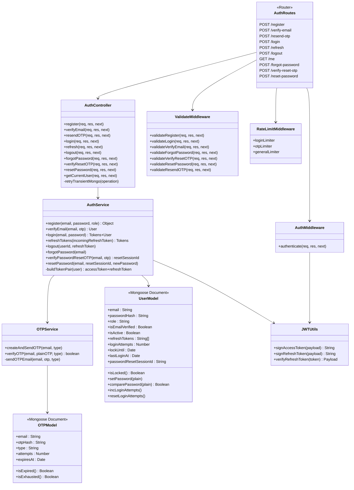
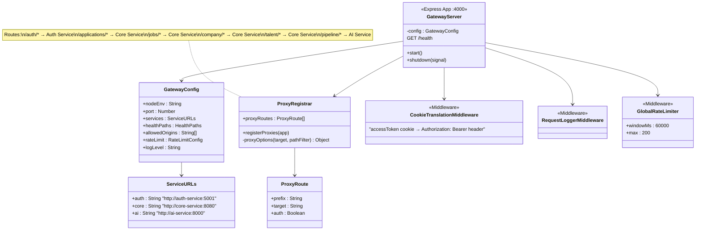

# InternNova — Class Diagrams

This document contains the structural class diagrams for all microservices in the InternNova codebase.

---

## 1. Core Service (Spring Boot)

```mermaid
classDiagram
    direction TB

    class TalentController {
        -TalentService talentService
        -AiPipelineClient aiPipelineClient
        -String internalToken
        +createTalent(TalentDTO, resume, avatar) ResponseEntity~Talent~
        +getTalent(id) ResponseEntity~Talent~
        +updateTalent(id, TalentDTO, resume, avatar) ResponseEntity~Talent~
        +deleteTalent(id) ResponseEntity~Void~
        +saveJob(id, jobId) ResponseEntity~Talent~
        +removeSavedJob(id, jobId) ResponseEntity~Talent~
        +getSavedJobs(id) ResponseEntity~List~Job~~
        +addExperience(Experience) ResponseEntity
        +updateExperience(index, Experience) ResponseEntity
        +deleteExperience(index) ResponseEntity
        +addProject(Project) ResponseEntity
        +updateProject(index, Project) ResponseEntity
        +deleteProject(index) ResponseEntity
        +addCertification(Certification) ResponseEntity
        +addAchievement(Achievement) ResponseEntity
        +getFullProfile(talentId) ResponseEntity
        +generateResume(GenerateResumeRequestDTO) ResponseEntity
        -getAuthUserId(request) String
        -validateOwnership(talentId, request)
        -isInternalServiceCall(request) boolean
    }

    class JobController {
        -JobService jobService
        +createJob(JobCreateDTO) ResponseEntity
        +getAllJobs(page, size, sortBy, sortDir, ...) ResponseEntity
        +getJob(id, viewerId) ResponseEntity~Job~
        +updateJob(id, JobUpdateDTO) ResponseEntity~Job~
        +deleteJob(id) ResponseEntity~Void~
        +getJobsByCompany(companyId) ResponseEntity~List~Job~~
        +publishResults(id) ResponseEntity
    }

    class ApplicationController {
        -ApplicationService applicationService
        +createApplicationMultipart(data, resumeFile) ResponseEntity
        +createApplicationJson(ApplicationCreateDTO) ResponseEntity
        +getApplicationsByJob(jobId, ...) ResponseEntity
        +getApplicationsByStudent(studentId, ...) ResponseEntity
        +getApplication(id, forStudent) ResponseEntity
        +shortlistApplication(id) ResponseEntity
        +rejectApplication(id, requestBody) ResponseEntity
        +updateApplicationStatus(id, requestBody) ResponseEntity
        +withdrawApplication(id) ResponseEntity~Void~
        +deleteApplication(id) ResponseEntity~Void~
        +getJobApplicationStats(jobId) ResponseEntity
        +getStudentApplicationStats(studentId) ResponseEntity
    }

    class CompanyController {
        -CompanyService companyService
        +createCompany(CompanyDTO, logo) ResponseEntity~Company~
        +getAllCompanies() ResponseEntity~List~Company~~
        +getCompany(id) ResponseEntity~Company~
        +updateCompany(id, CompanyDTO, logo) ResponseEntity~Company~
        +deleteCompany(id) ResponseEntity~Void~
    }

    class TalentService {
        -TalentRepository talentRepository
        -CloudinaryService cloudinaryService
        -JobRepository jobRepository
        +createTalent(TalentDTO, resume, avatar) Talent
        +getTalent(id) Talent
        +updateTalent(id, TalentDTO, resume, avatar) Talent
        +deleteTalent(id)
        +saveJob(talentId, jobId) Talent
        +removeSavedJob(talentId, jobId) Talent
        +getSavedJobs(talentId) List~Job~
        +addExperience(talentId, Experience) Talent
        +addProject(talentId, Project) Talent
        +addCertification(talentId, Certification) Talent
        +addAchievement(talentId, Achievement) Talent
        +getFullProfile(talentId) Talent
        +validateOwnership(talentId, requesterId)
        -updateTalentFromDTO(talent, dto)
        -sanitizeExperience(exp)
        -sanitizeProject(proj)
    }

    class JobService {
        -JobRepository jobRepository
        -ApplicationRepository applicationRepository
        -TalentRepository talentRepository
        -CompanyRepository companyRepository
        -EmailNotificationService emailNotificationService
        -AuthUserRepository authUserRepository
        +createJob(JobCreateDTO) Job
        +getAllJobs(pageable) Page~Job~
        +getJobById(id, viewerId) Optional~Job~
        +getJobsByCompany(companyId) List~Job~
        +getJobsByType(jobType, pageable) Page~Job~
        +getJobsByLocation(location, pageable) Page~Job~
        +searchJobs(keyword, pageable) Page~Job~
        +updateJob(id, JobUpdateDTO) Job
        +deleteJob(id)
        +publishResults(jobId) Job
        +incrementApplicationCount(jobId)
        +decrementApplicationCount(jobId)
        +expireJobs()
        -incrementViewCount(job, viewerId)
    }

    class ApplicationService {
        -ApplicationRepository applicationRepository
        -JobRepository jobRepository
        -TalentRepository talentRepository
        -CompanyRepository companyRepository
        -JobService jobService
        -CloudinaryService cloudinaryService
        -ApplicationEvaluationService applicationEvaluationService
        +createApplication(dto, resumeFile) Application
        +getApplicationsByJob(jobId) List~ApplicationResponseDTO~
        +getApplicationsByStudent(studentId) List~ApplicationResponseDTO~
        +getApplicationById(id, forStudent) ApplicationResponseDTO
        +shortlistApplication(id) Application
        +rejectApplication(id, notes) Application
        +updateApplicationStatus(id, status, notes) Application
        +deleteApplication(id)
        +withdrawApplication(id)
        +getApplicationsByJobAndStatus(jobId, status) List~Application~
        -convertToResponseDTO(app, forStudent) ApplicationResponseDTO
    }

    class ApplicationEvaluationService {
        -AiPipelineClient aiPipelineClient
        -ApplicationRepository applicationRepository
        -TalentRepository talentRepository
        +evaluate(application, job)$ async
        +evaluateSync(application, job) Application
        -evaluateInternal(application, job)
        -buildApplicationContext(studentId) ApplicationContextDTO
        -isResumeExtractionFailure(e) boolean
    }

    class AiPipelineClient {
        -RestClient restClient
        -String baseUrl
        +evaluate(EvaluateRequestDTO) EvaluateResponseDTO
        +generateResume(GenerateResumeRequestDTO) GenerateResumeResponseDTO
    }

    class CloudinaryService {
        -Cloudinary cloudinary
        +uploadFile(MultipartFile) String
        +deleteFile(url)
        -extractPublicId(url) String
    }

    class EmailNotificationService {
        -JavaMailSender mailSender
        +sendShortlistEmail(email, name, job, company)
        +sendRejectionEmail(email, name, job, company)
        -logEmail(to, subject, body, from)
    }

    class JobScheduler {
        -JobService jobService
        +expireJobsDaily()$ @Scheduled("0 0 0 * * ?")
    }

    class TalentAuthInterceptor {
        -JwtUtil jwtUtil
        +preHandle(request, response, handler) boolean
    }

    class JwtUtil {
        -SecretKeySpec signingKey
        +verifyAndParse(token) Claims
        +getUserId(claims) String
        +getUserRole(claims) String
    }

    TalentController --> TalentService
    TalentController --> AiPipelineClient
    JobController --> JobService
    ApplicationController --> ApplicationService
    CompanyController --> CompanyService

    TalentService --> TalentRepository
    TalentService --> CloudinaryService
    TalentService --> JobRepository
    JobService --> JobRepository
    JobService --> ApplicationRepository
    JobService --> EmailNotificationService
    JobService --> AuthUserRepository
    ApplicationService --> ApplicationRepository
    ApplicationService --> JobService
    ApplicationService --> CloudinaryService
    ApplicationService --> ApplicationEvaluationService
    ApplicationEvaluationService --> AiPipelineClient
    ApplicationEvaluationService --> ApplicationRepository
    ApplicationEvaluationService --> TalentRepository

    JobScheduler --> JobService
    TalentAuthInterceptor --> JwtUtil

    class CompanyService {
        -CompanyRepository companyRepository
        -CloudinaryService cloudinaryService
        +createCompany(CompanyDTO, logo) Company
        +getCompany(id) Company
        +updateCompany(id, CompanyDTO, logo) Company
        +deleteCompany(id)
        +getAllCompanies() List~Company~
    }

    CompanyService --> CompanyRepository
    CompanyService --> CloudinaryService
```

---

## 2. Auth Service (Node.js / Express)

---

## 3. AI Service (Python / FastAPI)

```mermaid
classDiagram
    direction TB

    class FastAPIApp {
        <<FastAPI>>
        GET /health
        POST /pipeline/v1/evaluate
        POST /pipeline/v1/generate-resume
    }

    class PipelineRouter {
        <<APIRouter prefix="/pipeline/v1">>
        +evaluate(EvaluateInput) EvaluateResult
        +generate_resume(GenerateResumeInput) GenerateResumeResult
    }

    class EvaluateService {
        +evaluate_application(EvaluateInput) EvaluateResult
    }

    class ParserService {
        +parse_resume(ParseInput) dict
    }

    class ParserGraph {
        <<LangGraph StateGraph>>
        download_pdf → extract_text → llm_parse → result
    }

    class PDFExtractor {
        +download_and_extract(url) String
    }

    class ShortlistService {
        +decide_shortlist(ShortlistInput) ShortlistDecision
    }

    class ShortlistGraph {
        <<LangGraph StateGraph>>
        build_prompt → llm_decide → result
    }

    class ResumeGeneratorService {
        +generate_resume(GenerateResumeInput) GenerateResumeResult
    }

    class ResumeGeneratorGraph {
        <<LangGraph StateGraph>>
        fetch_profile → llm_content → assemble_tex → compile_pdf
    }

    class ProfileClient {
        +fetch_talent_profile(talentId) TalentProfile
    }

    class LaTeXCompiler {
        +compile_tex(tex_source) bytes
    }

    class EvaluateInput {
        +applicationId : str
        +studentId : str
        +jobId : str
        +resumeUrl : str
        +job : JobContext
        +applicationContext : ApplicationContext
    }

    class EvaluateResult {
        +applicationId : str
        +studentId : str
        +jobId : str
        +is_fake : bool
        +fake_confidence : float
        +fake_reasons : List~str~
        +decision : str
        +matchScore : float
        +reasons : List~str~
        +resume : ResumeData
    }

    class ResumeData {
        +name : str
        +email : str
        +phone : str
        +location : str
        +links : Links
        +summary : str
        +skills : List~str~
        +education : List~Education~
        +experience : List~Experience~
        +projects : List~Project~
        +certifications : List~str~
        +achievements : List~str~
        +spoken_languages : List~str~
    }

    class ParsedResume {
        +is_fake : bool
        +fake_confidence : float
        +fake_reasons : List~str~
        +resume : ResumeData
    }

    class ShortlistDecision {
        +decision : REJECTED|UNDER_REVIEW|SHORTLISTED
        +match_score : int
        +reasons : List~str~
    }

    class JobContext {
        +title : str
        +description : str
        +requirements : str
        +responsibilities : str
        +skillsRequired : List~str~
        +location : str
        +remoteOption : bool
        +jobType : str
        +duration : str
        +selectionCriteria : str
    }

    class GenerateResumeInput {
        +talentId : str
        +template : classic|modern
        +email : str
        +phone : str
        +jobTitle : str
        +jobDescription : str
    }

    class GenerateResumeResult {
        +talentId : str
        +template : TemplateStyle
        +tailored : bool
        +tex : str
        +pdfBase64 : str
    }

    FastAPIApp --> PipelineRouter
    PipelineRouter --> EvaluateService
    PipelineRouter --> ResumeGeneratorService

    EvaluateService --> ParserService
    EvaluateService --> ShortlistService
    ParserService --> ParserGraph
    ParserGraph --> PDFExtractor
    ShortlistService --> ShortlistGraph

    ResumeGeneratorService --> ResumeGeneratorGraph
    ResumeGeneratorGraph --> ProfileClient
    ResumeGeneratorGraph --> LaTeXCompiler
```

---

## 4. API Gateway (Node.js / Express)

