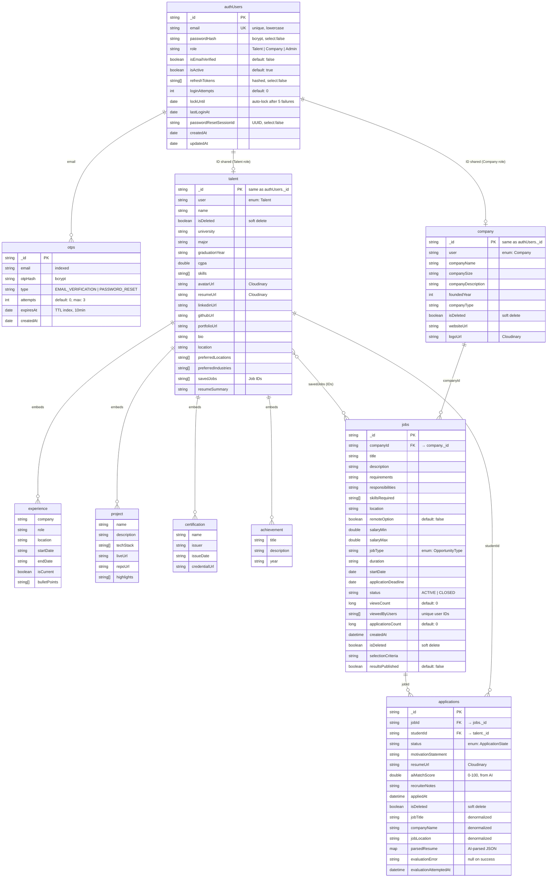

# InternNova — Database Entity-Relationship Diagram (ERD)

> All collections live in a single **MongoDB** database (`internnova-dev`). Relationships are maintained via string ID references (not foreign keys — this is a document DB). Embedded documents are shown as compositions.

---

## Entity-Relationship Diagram

### Enum Definitions

| Enum | Values |
|------|--------|
| **User** (role) | `Talent`, `Company`, `Admin` |
| **OpportunityType** | `INTERNSHIP`, `FULL_TIME`, `PART_TIME`, `CONTRACT`, `FREELANCE` |
| **ApplicationState** | `APPLIED`, `UNDER_REVIEW`, `SHORTLISTED`, `REJECTED`, `WITHDRAWN` |
| **OTP Type** | `EMAIL_VERIFICATION`, `PASSWORD_RESET` |
