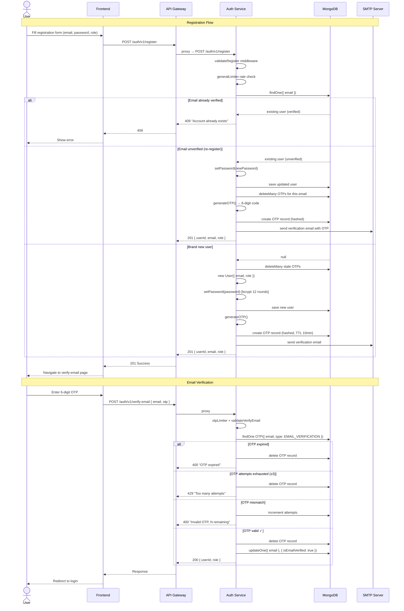
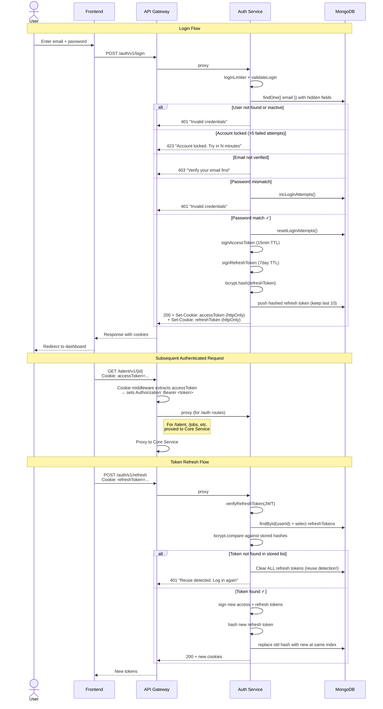
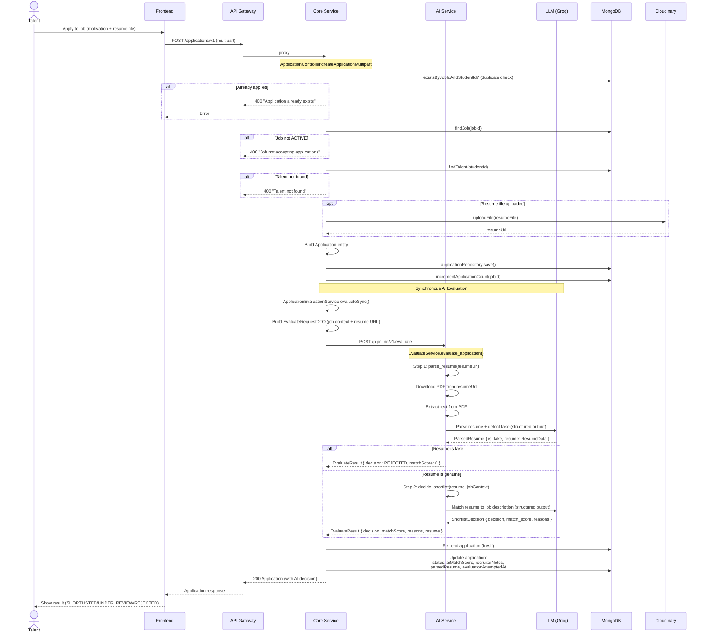
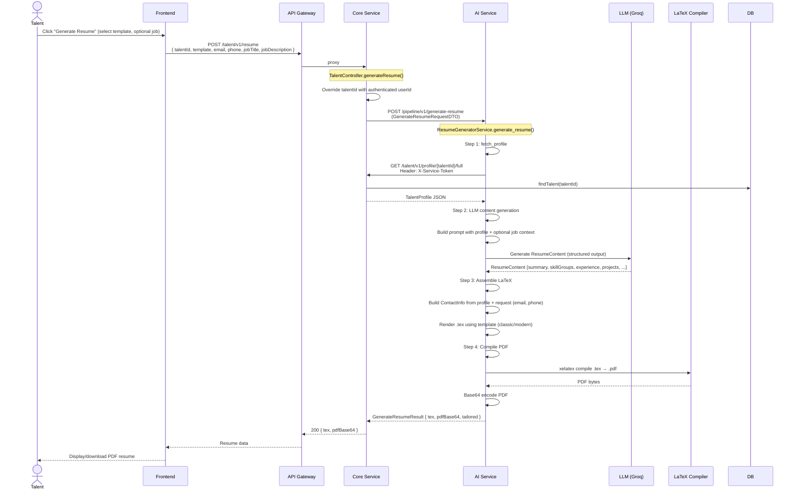
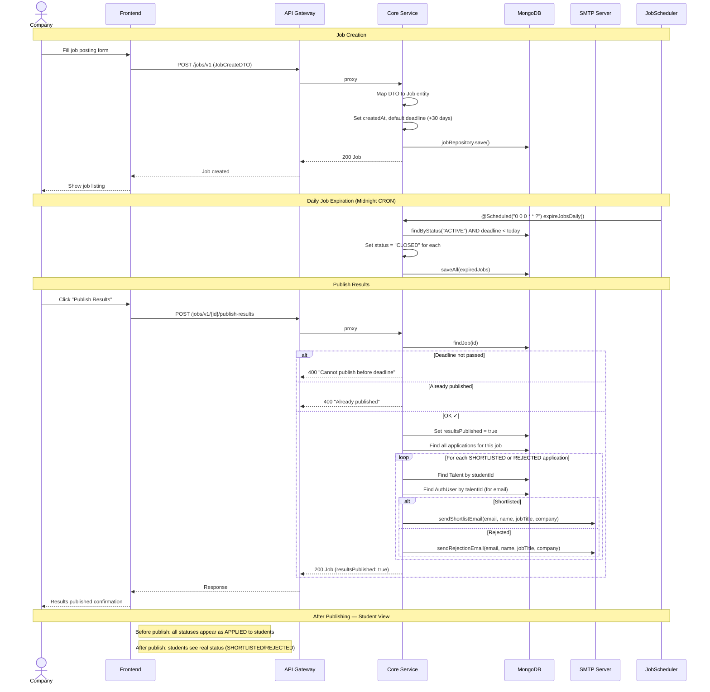
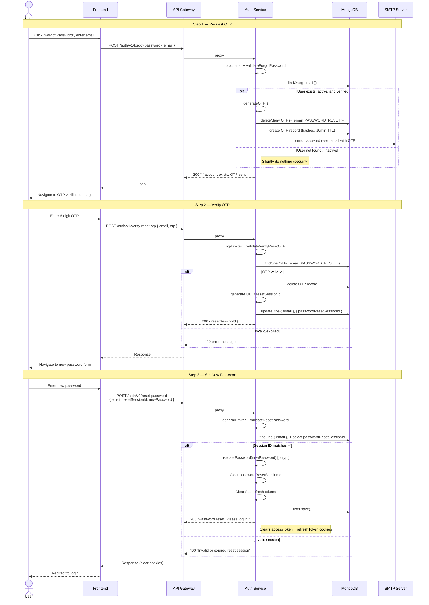
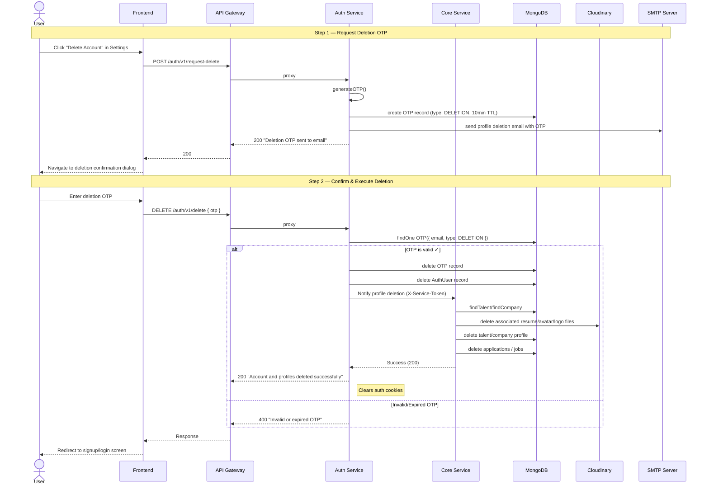

# InternNova — Sequence Diagrams

This document contains all sequence diagrams mapping temporal message exchanges between system services, client apps, databases, and background schedulers.

---

## 1. User Registration & Email Verification

---

## 2. User Login & Token Refresh

---

## 3. Job Application Submission with AI Evaluation

---

## 4. AI Resume Generation & Tailoring

---

## 5. Job Lifecycle

---

## 6. Password Reset Flow

---

## 7. Secure Account Deletion Flow

