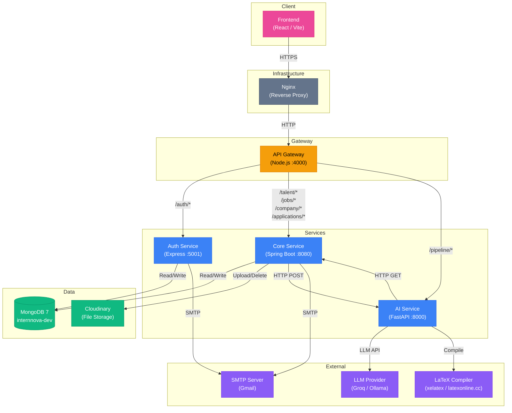

# InternNova — System Architecture Overview

> **Production-Grade Documentation** — All diagrams use **Mermaid** syntax for native rendering in GitHub, GitLab, Notion, and most modern Markdown viewers.

---

## System Architecture Diagram

### Service Summary

| Service | Tech Stack | Port | Responsibility |
|---------|-----------|------|----------------|
| **API Gateway** | Node.js, Express, http-proxy-middleware | 4000 | Single entry point, CORS, rate limiting, cookie→header translation, request proxying |
| **Auth Service** | Node.js, Express, Mongoose, bcryptjs, jsonwebtoken | 5001 | Registration, email verification (OTP), login, JWT access/refresh tokens, password reset |
| **Core Service** | Java 17, Spring Boot, Spring Data MongoDB, Cloudinary SDK | 8080 | Talent profiles, companies, job postings, applications, AI evaluation orchestration, email notifications, scheduled tasks |
| **AI Service** | Python, FastAPI, LangChain/LangGraph, Pydantic, LaTeX | 8000 | Resume parsing (PDF→structured JSON), fake detection, shortlist decisions, resume PDF generation |
