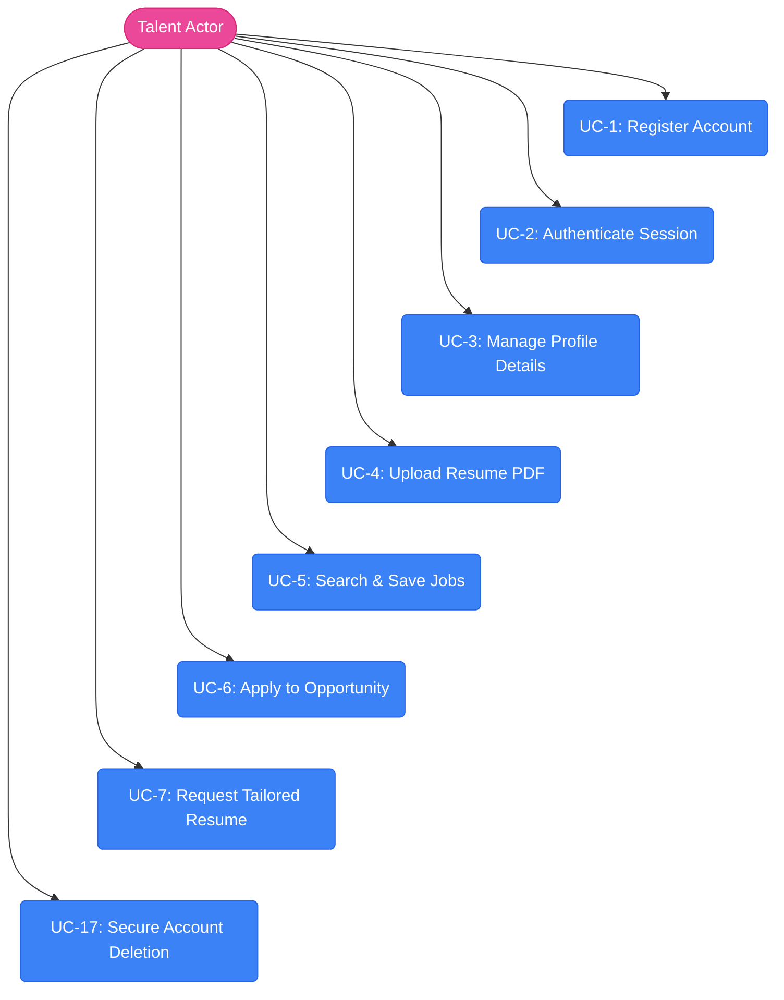
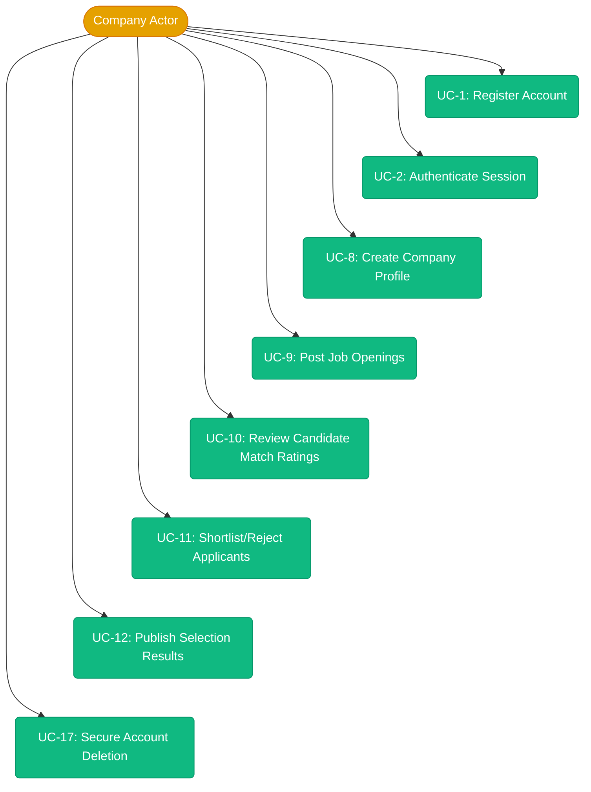
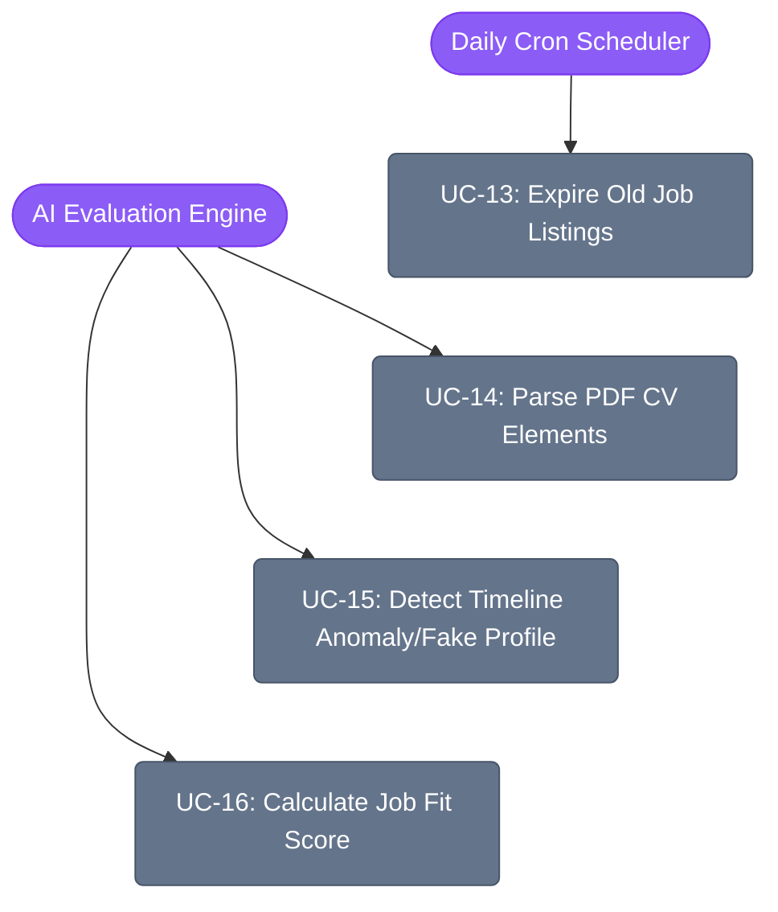

# System Use Cases & Interaction Diagrams

This document details the functional use cases and boundaries of the InternNova platform, mapping system actors to their permitted actions.

---

## 1. System Actors

* **Talent (Job Seeker)**: Standard candidate user seeking jobs, managing their profiles, requesting tailored resumes, and applying to active job posts.
* **Company (Recruiter)**: Hiring entity capable of creating and managing company pages, posting jobs, reviewing applicants, and deciding candidate states.
* **Admin (System Administrator)**: Oversees system health, monitors security parameters, and moderates content.
* **Scheduler (Job Scheduler)**: Cron-based automation actor running nightly tasks like job expiration checks.
* **AI Engine (Evaluation Pipeline)**: Background processing actor running resume parsing, timeline analysis, and fit matching.

---

## 2. Use Case Diagrams (Vertical Layout)

### 2.1 Talent Use Cases (Vertical)

### 2.2 Company Use Cases (Vertical)

### 2.3 System & Background Actor Use Cases (Vertical)

---

## 3. Use Case Descriptions

### UC-1: Register Account
* **Primary Actor**: Talent or Company
* **Precondition**: User is not authenticated.
* **Trigger**: User navigates to register and submits the registration form.
* **Main Flow**:
  1. User fills email, password, and chosen role (`Talent` or `Company`).
  2. Gateway routes request to Auth Service.
  3. Auth Service hashes password (using bcrypt with 12 rounds), inserts user database record (`isEmailVerified=false`, `isActive=false`), and generates a 6-digit OTP code.
  4. System sends verification OTP to user's email via SMTP server.
  5. User inputs OTP on the Frontend.
  6. Auth Service validates OTP, deletes OTP record, and updates user state to active (`isEmailVerified=true`, `isActive=true`).
* **Alternative Flows**:
  * **Email already verified**: Auth Service returns `409 Conflict` response.
  * **Stale email registration**: If email is registered but unverified, Auth Service replaces the password, resets the OTP attempts, generates a new OTP, and emails it.
  * **Expired/Invalid OTP**: Auth Service returns `400 Bad Request` or `429 Too Many Attempts` (if 3 consecutive failures occur, locking the verification attempt).

---

### UC-2: Authenticate Session
* **Primary Actor**: Talent or Company
* **Precondition**: User has verified account (`isEmailVerified=true`, `isActive=true`).
* **Trigger**: User submits login form on the Frontend.
* **Main Flow**:
  1. User inputs email and password.
  2. Frontend sends request to API Gateway which proxies it to Auth Service.
  3. Auth Service verifies password match using bcrypt and retrieves user details.
  4. Auth Service generates an Access Token JWT (15-min expiry) and a Refresh Token JWT (7-day expiry).
  5. Auth Service hashes the Refresh Token and stores it in MongoDB (keeping only the last 10 active tokens).
  6. Auth Service sends tokens back in HTTP-Only, Secure, SameSite cookies.
* **Alternative Flows**:
  * **Incorrect Password**: Login fails, and failed login attempt counter increments. If failed attempts exceed 5, the account is locked for 15 minutes (`423 Locked`).
  * **Session Refresh**: Frontend requests `/auth/v1/refresh` using the Refresh Token cookie. Auth Service verifies it, generates a new Access/Refresh token pair, replaces the old hash in the database, and returns them as cookies.
  * **Token Reuse Detection**: If a revoked Refresh Token is reused, the Auth Service clears all active Refresh Tokens for that user and prompts a full re-login.

---

### UC-3: Manage Profile Details
* **Primary Actor**: Talent
* **Precondition**: Talent is authenticated.
* **Trigger**: Talent updates profile fields on their profile page.
* **Main Flow**:
  1. Talent opens profile edit page on the Frontend.
  2. Talent updates core fields: name, university, major, graduation year, CGPA, social links, bio, and skills.
  3. Talent manages nested entities (adds, edits, or removes items):
     - **Work Experiences**: Company name, role, start/end dates, description.
     - **Academic Projects**: Project name, description, tech stack, repo link.
     - **Certifications**: Title, issuer, date.
     - **Achievements**: Description.
  4. Core Service validates ownership (preventing cross-user modifications via Gateway middleware).
  5. Core Service updates the Talent record in MongoDB.
* **Alternative Flows**:
  * **Validation Failures**: If input validation fails (e.g. CGPA > 10.0 or negative), Core Service returns `400 Bad Request` and changes are not committed.

---

### UC-4: Upload Resume PDF
* **Primary Actor**: Talent
* **Precondition**: Talent is authenticated.
* **Trigger**: Talent selects a local PDF file and uploads it in profile or application settings.
* **Main Flow**:
  1. Talent uploads a PDF file on the Frontend.
  2. Frontend sends multipart form request to API Gateway, which proxies to Core Service.
  3. Core Service validates file format (must be PDF) and file size (under limit).
  4. Core Service uploads file binary to Cloudinary.
  5. Cloudinary returns a secure PDF URL.
  6. Core Service updates the `resumeUrl` field in the Talent profile in MongoDB.

---

### UC-5: Search & Save Jobs
* **Primary Actor**: Talent
* **Precondition**: Talent is authenticated.
* **Trigger**: Talent inputs search terms or clicks "Save" on a job post.
* **Main Flow**:
  1. Talent inputs query criteria (keyword, location, job type) on the job board.
  2. Core Service executes search queries against active job listings in MongoDB.
  3. Talent clicks "Save Job" on a listing.
  4. Core Service appends the `jobId` to the Talent's `savedJobs` array.
* **Alternative Flows**:
  * **Unsave Job**: Talent clicks "Unsave Job". Core Service removes the `jobId` from the Talent's `savedJobs` array.

---

### UC-6: Apply to Opportunity with AI Evaluation
* **Primary Actor**: Talent
* **Secondary Actor**: AI Engine
* **Precondition**: Talent is authenticated, has complete profile/resume, and job is `ACTIVE`.
* **Trigger**: Talent selects active job, enters motivation statement, and clicks apply.
* **Main Flow**:
  1. Talent selects active job and inputs a motivation statement.
  2. Talent uploads a custom PDF resume (or chooses pre-saved resume).
  3. Core Service uploads file to Cloudinary and saves Application record.
  4. Core Service invokes AI Service evaluate endpoint.
  5. AI Service downloads the CV, extracts raw text, and structures profile details.
  6. AI Service verifies credentials against anomalies (fake detection).
  7. AI Service matches resume against job requirements to calculate compatibility.
  8. Application status is updated synchronously.
  9. Response returns to candidate showing evaluation complete.

---

### UC-7: Request Tailored Resume (LaTeX PDF Generator)
* **Primary Actor**: Talent
* **Secondary Actor**: AI Engine
* **Precondition**: Talent profile is updated and has added work experiences/projects.
* **Trigger**: Talent selects "Generate Tailored Resume" and inputs job specifications.
* **Main Flow**:
  1. Talent requests resume generation, selecting template (`classic` or `modern`) and optional job context.
  2. Core Service proxies request to AI Service.
  3. AI Service retrieves full candidate profile details from Core Service.
  4. AI Service builds structured resume data using LLM optimization.
  5. AI Service injects fields into selected LaTeX template.
  6. AI Service compiles LaTeX markup into a PDF document.
  7. Compiled PDF is converted to Base64 and sent to candidate frontend for download.

---

### UC-8: Create Company Profile
* **Primary Actor**: Company
* **Precondition**: Company user is authenticated.
* **Trigger**: Recruiter opens company settings screen and submits info.
* **Main Flow**:
  1. Recruiter fills company form: name, description, size, type, founded year, website URL.
  2. Recruiter uploads a company logo file.
  3. Core Service uploads logo to Cloudinary, receiving a URL.
  4. Core Service creates and saves the Company profile record in MongoDB.
* **Alternative Flows**:
  * **Update Profile**: If a profile already exists, Core Service updates the existing record.

---

### UC-9: Post Job Openings
* **Primary Actor**: Company
* **Precondition**: Company profile has been created and verified.
* **Trigger**: Recruiter opens creation portal and submits job specs.
* **Main Flow**:
  1. Recruiter opens creation portal.
  2. Recruiter fills job specs (title, salary range, requirements, selection criteria, deadline).
  3. Core Service validates parameters and saves job posting.
  4. Job posting becomes active on the public feed.

---

### UC-10: Review Candidate Match Ratings
* **Primary Actor**: Company
* **Precondition**: Recruiter is authenticated and job posting is owned by their company.
* **Trigger**: Recruiter selects a job and views applicant list.
* **Main Flow**:
  1. Recruiter opens the job applicant page on the Frontend.
  2. Core Service fetches all application records for the given `jobId`.
  3. Recruiter views candidate names, motivation statement, and AI-computed match scores (0-100).
  4. Recruiter clicks a candidate's application details.
  5. System displays AI-parsed resume summary, fit evaluation analysis (strengths, gaps), and fake-resume check results (is_fake, confidence, reasons).

---

### UC-11: Shortlist/Reject Applicants
* **Primary Actor**: Company
* **Precondition**: Recruiter is authenticated and application is in `UNDER_REVIEW` state.
* **Trigger**: Recruiter marks a candidate's status.
* **Main Flow**:
  1. Recruiter selects candidate application.
  2. Recruiter selects decision: "Shortlist" or "Reject", and optionally adds recruiter notes.
  3. Core Service updates the application status to `SHORTLISTED` or `REJECTED` in MongoDB.
* **Alternative Flows**:
  * **Bulk Decisioning**: Recruiter selects multiple candidates and applies the status change in bulk.

---

### UC-12: Publish Selection Results
* **Primary Actor**: Company
* **Precondition**: Job posting status is `CLOSED` (application deadline passed).
* **Trigger**: Recruiter triggers "Publish Results" endpoint.
* **Main Flow**:
  1. Recruiter views applicants and marks decisions (`SHORTLISTED` or `REJECTED`).
  2. Recruiter triggers "Publish Results" endpoint.
  3. Core Service sets `resultsPublished: true` on the job posting.
  4. Core Service scans applications and triggers email dispatch loops.
  5. Shortlisted candidates receive invitation emails; rejected candidates receive feedback emails.

---

### UC-13: Expire Old Job Listings
* **Primary Actor**: Scheduler (Daily Cron Scheduler)
* **Precondition**: System is running normally.
* **Trigger**: Clock strikes midnight (CRON trigger: `"0 0 0 * * ?"`).
* **Main Flow**:
  1. Core Service scheduler triggers the daily job expiration task.
  2. Core Service queries MongoDB for job postings where `status` is `ACTIVE` and `deadline` is prior to the current date/time.
  3. Core Service transitions status to `CLOSED` for each expired job.
  4. Core Service commits the batch updates to MongoDB.
  5. Scheduler logs execution metrics (number of expired jobs).

---

### UC-14: Parse PDF CV Elements
* **Primary Actor**: AI Engine
* **Precondition**: Core Service requests application evaluation or profile parsing.
* **Trigger**: AI Service receives evaluate application endpoint request.
* **Main Flow**:
  1. AI Service downloads the CV PDF file from Cloudinary (provided by `resumeUrl`).
  2. AI Service extracts raw text from PDF bytes.
  3. AI Service builds prompt structure containing raw text.
  4. AI Service queries the LLM (Groq API) with a structured output schema (Pydantic models).
  5. LLM returns structured JSON data containing education, skills, work history, projects, and contact details.
  6. AI Service verifies the structure and returns the parsed resume to the calling flow.

---

### UC-15: Detect Timeline Anomaly/Fake Profile
* **Primary Actor**: AI Engine
* **Precondition**: Parse PDF CV Elements (UC-14) is completed successfully.
* **Trigger**: Run as part of the evaluate application pipeline.
* **Main Flow**:
  1. AI Service analyses the extracted text timeline (e.g. concurrent full-time roles, conflicting graduation dates, graduation year preceding start date of multi-year jobs).
  2. AI Service sends the parsed experience blocks to the LLM.
  3. LLM evaluates claims, credentials, and timeline consistency.
  4. LLM returns a structured evaluation containing `is_fake` (boolean), a confidence score, and a list of specific reasons/discrepancies detected.
  5. AI Service adds the fake detection payload to the evaluation result.

---

### UC-16: Calculate Job Fit Score
* **Primary Actor**: AI Engine
* **Precondition**: Parse PDF CV Elements (UC-14) is completed successfully and profile is genuine.
* **Trigger**: Run as part of the evaluate application pipeline.
* **Main Flow**:
  1. AI Service builds a matching matrix comparing candidate's education, skills, and work experiences against the job specifications and selection criteria.
  2. AI Service queries the LLM with the comparison context and a scoring rubric.
  3. LLM calculates an overall match score from 0 to 100 and lists match strengths, gaps, and recommendations.
  4. AI Service compiles the results into a `ShortlistDecision` payload and returns it to the Core Service.

---

### UC-17: Secure Account Deletion
* **Primary Actor**: Talent or Company
* **Precondition**: User is authenticated.
* **Trigger**: User requests account deletion in settings.
* **Main Flow**:
  1. User requests account deletion in settings.
  2. Auth Service generates a profile deletion OTP and emails it to the user.
  3. User enters the OTP to confirm deletion.
  4. Auth Service verifies the OTP and executes deletion:
     - Removes `authUsers` credentials.
     - Core Service deletes the `talent`/`company` profile records and related documents (Experiences, Projects, Applications).
     - Deletes CV files/avatars stored on Cloudinary.
     - Logs out user and clears cookies.
