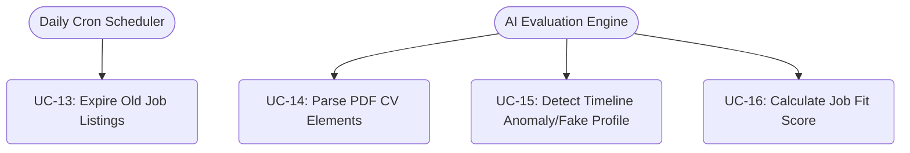

# System Use Cases & Interaction Diagrams

This document details the functional use cases and boundaries of the InternNova platform, mapping system actors to their permitted actions.

---

## 1. System Actors

* **Talent (Job Seeker)**: Standard candidate user seeking jobs, managing their profiles, requesting tailored resumes, and applying to active job posts.
* **Company (Recruiter)**: Hiring entity capable of creating and managing company pages, posting jobs, reviewing applicants, and deciding candidate states.
* **Admin (System Administrator)**: Oversees system health, monitors security parameters, and moderates content.
* **Scheduler (Job Scheduler)**: Cron-based automation actor running nightly tasks like job expiration checks.
* **AI Engine (Evaluation Pipeline)**: Background processing actor running resume parsing, timeline analysis, and fit matching.

---

## 2. Use Case Diagrams

### 2.1 Talent & Company Use Cases

```mermaid
graph TD
    %% Actors
    Talent([Talent Actor])
    Company([Company Actor])

    %% Use Cases
    UC1(UC-1: Register Account)
    UC2(UC-2: Authenticate Session)
    UC3(UC-3: Manage Profile Details)
    UC4(UC-4: Upload Resume PDF)
    UC5(UC-5: Search & Save Jobs)
    UC6(UC-6: Apply to Opportunity)
    UC7(UC-7: Request Tailored Resume)
    UC17(UC-17: Secure Account Deletion)

    UC8(UC-8: Create Company Profile)
    UC9(UC-9: Post Job Openings)
    UC10(UC-10: Review Candidate Match Ratings)
    UC11(UC-11: Shortlist/Reject Applicants)
    UC12(UC-12: Publish Selection Results)

    %% Connections
    Talent --> UC1
    Talent --> UC2
    Talent --> UC3
    Talent --> UC4
    Talent --> UC5
    Talent --> UC6
    Talent --> UC7
    Talent --> UC17

    Company --> UC1
    Company --> UC2
    Company --> UC8
    Company --> UC9
    Company --> UC10
    Company --> UC11
    Company --> UC12
    Company --> UC17
```

### 2.2 System & Background Actor Use Cases

---

## 3. Use Case Descriptions

### UC-1: Register & Activate Account
* **Primary Actor**: Talent or Company
* **Precondition**: User is not authenticated.
* **Trigger**: User navigates to register and submits the form.
* **Main Flow**:
  1. User fills email, password, and chosen role.
  2. Gateway routes request to Auth Service.
  3. Auth Service hashes password, inserts user database record (verified=false), and generates a 6-digit OTP.
  4. System sends verification OTP to candidate's email.
  5. User inputs OTP on the Frontend.
  6. Auth Service validates OTP and updates user state to active (verified=true).

---

### UC-6: Apply to Opportunity with AI Evaluation
* **Primary Actor**: Talent
* **Secondary Actor**: AI Engine
* **Precondition**: Talent is authenticated, has complete profile/resume, and job is `ACTIVE`.
* **Main Flow**:
  1. Talent selects active job and inputs a motivation statement.
  2. Talent uploads a custom PDF resume (or chooses pre-saved resume).
  3. Core Service uploads file to Cloudinary and saves Application record.
  4. Core Service invokes AI Service evaluate endpoint.
  5. AI Service downloads the CV, extracts raw text, and structures profile details.
  6. AI Service verifies credentials against anomalies (fake detection).
  7. AI Service matches resume against job requirements to calculate compatibility.
  8. Application status is updated synchronously.
  9. Response returns to candidate showing evaluation complete.

---

### UC-7: Request Tailored Resume (LaTeX PDF Generator)
* **Primary Actor**: Talent
* **Precondition**: Talent profile is updated and has added work experiences/projects.
* **Main Flow**:
  1. Talent requests resume generation, selecting template (`classic` or `modern`) and optional job context.
  2. Core Service proxies request to AI Service.
  3. AI Service retrieves full candidate profile details from Core Service.
  4. AI Service builds structured resume data using LLM optimization.
  5. AI Service injects fields into selected LaTeX template.
  6. AI Service compiles LaTeX markup into a PDF document.
  7. Compiled PDF is converted to Base64 and sent to candidate frontend for download.

---

### UC-9: Post Job Openings
* **Primary Actor**: Company
* **Precondition**: Company profile has been created and verified.
* **Main Flow**:
  1. Recruiter opens creation portal.
  2. Recruiter fills job specs (title, salary range, requirements, selection criteria, deadline).
  3. Core Service validates parameters and saves job posting.
  4. Job posting becomes active on the public feed.

---

### UC-12: Publish Selection Results
* **Primary Actor**: Company
* **Precondition**: Job posting status is `CLOSED` (application deadline passed).
* **Main Flow**:
  1. Recruiter views applicants and marks decisions (`SHORTLISTED` or `REJECTED`).
  2. Recruiter triggers "Publish Results" endpoint.
  3. Core Service sets `resultsPublished: true` on the job posting.
  4. Core Service scans applications and triggers email dispatch loops.
  5. Shortlisted candidates receive invitation emails; rejected candidates receive feedback emails.

---

### UC-17: Secure Account Deletion
* **Primary Actor**: Talent or Company
* **Precondition**: User is authenticated.
* **Main Flow**:
  1. User requests account deletion in settings.
  2. Auth Service generates a profile deletion OTP and emails it to the user.
  3. User enters the OTP to confirm deletion.
  4. Auth Service verifies the OTP and executes deletion:
     - Removes `authUsers` credentials.
     - Core Service deletes the `talent`/`company` profile records and related documents (Experiences, Projects, Applications).
     - Deletes CV files/avatars stored on Cloudinary.
     - Logs out user and clears cookies.
